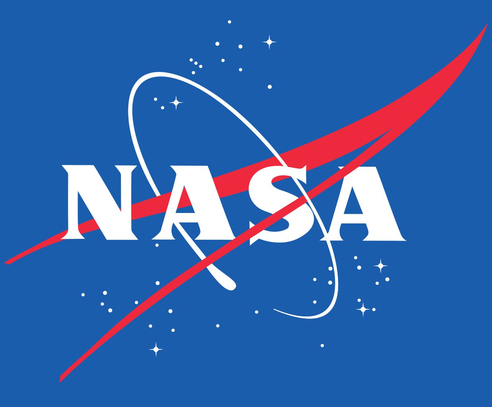

<div align="center">
</br>

### Mars Pathfinder

> Mars Pathfinder was an American robotic spacecraft that landed a base station with a roving probe on Mars in 1997. It consisted of a lander, renamed the Carl Sagan Memorial Station, and a lightweight, 10.6 kg (23 lb) wheeled robotic Mars rover named Sojourner, the first rover to operate outside the Earth–Moon system. The mission terminated in 1998.
---

</br>

</div>

Want to see more? [Go here...](res/more)

## 🚀 Setup Instructions

### Prerequisites

- [Docker](https://www.docker.com/)

1. Clone the repository:

   ```bash
   git clone https://github.com/karmeev/mars-pathfinder.git
   cd mars-pathfinder
   ```
2. Start backend
   ```bash
   make space
   ```